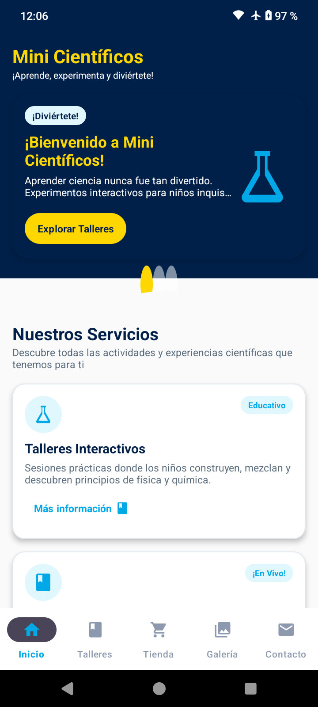
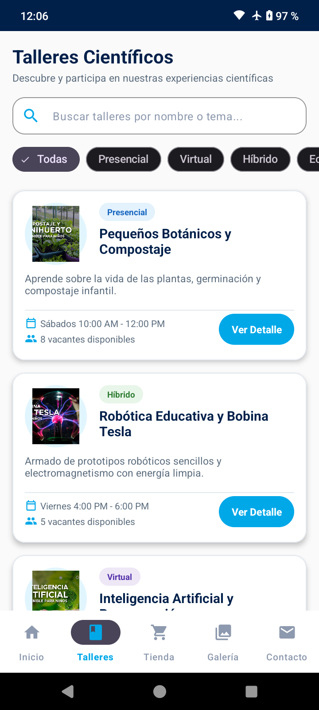
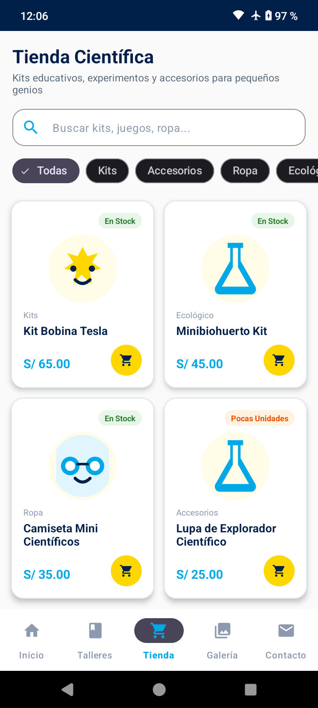
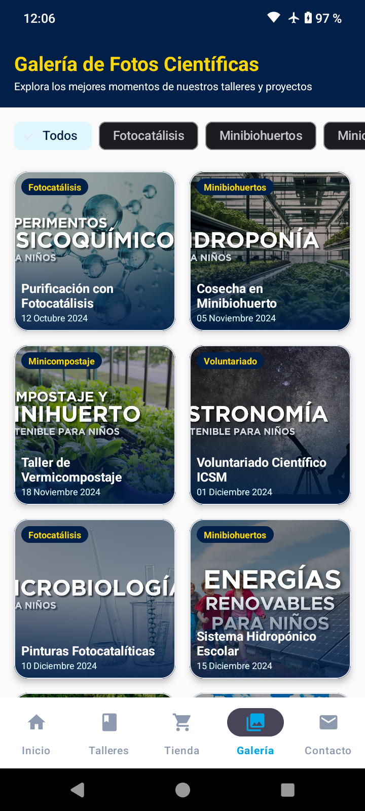
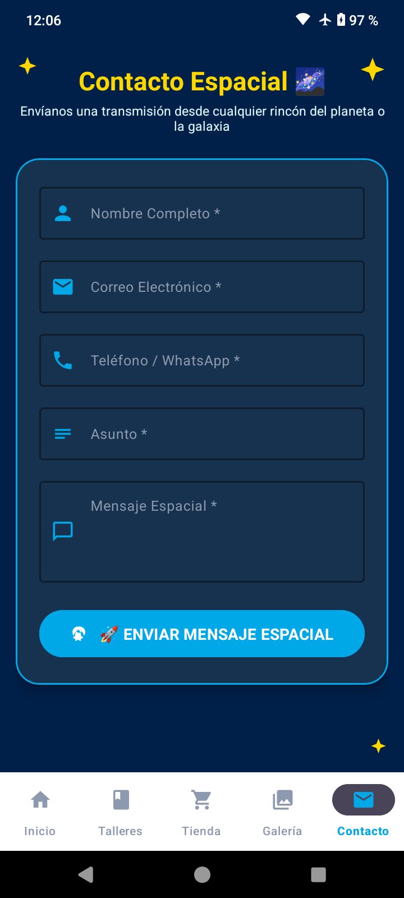

# 🔬 Mini Científicos - App Nativa Android



## 📌 Descripción del Proyecto
**Mini Científicos** es una aplicación nativa para Android desarrollada en **Java**, diseñada para trasladar la experiencia de la plataforma web oficial a una interfaz móvil interactiva, colorida y optimizada. Su objetivo es acercar la ciencia a niños, padres de familia y colegios mediante talleres, experimentos en vivo, espectáculos y kits educativos.

---

## 📸 Capturas de Pantalla

| Inicio | Talleres | Tienda |
| :---: | :---: | :---: |
|  |  |  |

| Galería | Contacto |
| :---: | :---: |
|  |  |

---

## 🛠️ Tecnologías y Stack Utilizado

* **Lenguaje:** Java 100% (Desarrollo nativo).
* **Diseño UI/UX:** Material Design 3 (M3) adaptado para un público infantil/educativo.
* **Vinculación de Vistas:** `ViewBinding` para un acceso directo, seguro y eficiente a las vistas en XML.
* **Tipografías:** Integración de Google Fonts (`Fredoka`, `Poppins`, `Rajdhani`) mediante *Downloadable Fonts*.
* **Navegación:**
  * `BottomNavigationView` para la conmutación entre las 5 secciones principales.
  * `FragmentContainerView` gestionado dinámicamente desde `MainActivity`.
  * `BottomSheetDialogFragment` para mostrar información detallada de los talleres en un panel emergente.
* **Componentes Interactivos:**
  * `ViewPager2` + `TabLayoutMediator` para el carrusel promocional (Hero Slider).
  * `RecyclerView` con adaptadores personalizados (`Adapter` y `ViewHolder`) para listas dinámicas y cuadrículas.
  * `NestedScrollView` para un desplazamiento vertical fluido.

---

## 📁 Estructura del Proyecto

El código está organizado de manera limpia y modular en el paquete principal `com.icsm.minicientificos_android`:

```text
app/src/main/java/com/icsm/minicientificos_android/
├── 📂 models/       # Clases de datos (TallerMock, ProductoMock, GaleriaMock, SliderItem)
├── 📂 adapters/     # Adaptadores de RecyclerView (TallerAdapter, ProductoAdapter, GaleriaAdapter)
├── 📂 ui/           # Fragmentos y pantallas (HomeFragment, WorkshopsFragment, ShopFragment, etc.)
└── 📄 MainActivity.java # Control de la navegación principal
```

### Recursos del Sistema (`app/src/main/res/`):
* 📄 **layout/**: Plantillas XML de pantallas, ítems de listas y ventanas modales.
* 📄 **drawable/**: Gráficos vectoriales (`wave_divider.xml`), fondos redondeados y fotos.
* 📄 **values/**: Paleta de colores (`colors.xml`), dimensiones de espaciado (`dimens.xml`) y temas (`themes.xml`).
* 📄 **font/**: Definiciones XML para fuentes de Google Fonts.

---

## 🌟 Módulos y Funcionalidades

1. 🏠 **Inicio (Home):**
   * Carrusel promocional dinámico con indicadores circulares (Swiper.js nativo).
   * Vista previa de la oferta de servicios y presentación lúdica de los personajes (**Titan** y **Tesla**).
   * Botón con acceso directo para contacto por WhatsApp.

2. 🧪 **Talleres y Experimentos:**
   * Lista interactiva de talleres con filtros y tarjetas informativas.
   * Panel desplegable inferior (`BottomSheet`) con detalles completos, materiales, duración e imágenes.

3. 🛒 **Tienda Científica:**
   * Catálogo de kits y juguetes educativos con imágenes, precios y opciones de reserva.

4. 🖼️ **Galería:**
   * Cuadrícula fotográfica de eventos reales, shows en vivo y actividades escolares.

5. 📞 **Contacto:**
   * Información institucional, canales de atención e integración para contrataciones.

---

## 🚀 Cómo Ejecutar el Proyecto

1. **Clonar el repositorio:**
   ```bash
   git clone https://github.com/mrpeak-1/MiniCientificos-Android.git
   ```
2. **Abrir en Android Studio:**
   * Selecciona `Open an Existing Project` y elige la carpeta del proyecto.
3. **Sincronizar Gradle:**
   * Espera a que Android Studio descargue las dependencias y construya el proyecto.
4. **Ejecutar:**
   * Conecta un dispositivo físico o inicia un emulador y presiona **Run** (`Shift + F10`).

---

## 👨‍💻 Desarrollado por
* **Usuario:** mrpeak-1
* **Correo:** geronimo.star.246@gmail.com
* **Proyecto:** Informe de Formación Práctica / Migración Nativa Android
